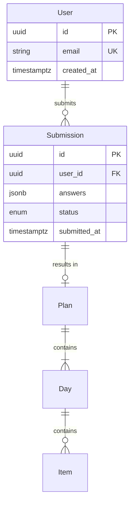

# DB Schema — [System Name]

**Owner:** [SA name] · **Version:** [x.y] · **DB engine:** [PostgreSQL / MySQL / Firestore / etc.]
**Related:** DDD (domain model), Migration scripts (source of truth)

---

## 1. Conventions

- **Naming:** `snake_case` for tables and columns
- **Primary key:** UUID (`id`) unless otherwise noted
- **Timestamps:** every table has `created_at`, `updated_at` (nullable) — timestamptz
- **Soft delete:** user-facing entities use `deleted_at` (timestamptz nullable)
  — treat NULL as active
- **FK indexes:** always indexed
- **Boolean flags:** default explicit (`DEFAULT false`)
- **Enums:** use CHECK constraints or ENUM types; document in this doc
- **JSON columns:** last resort — prefer normalized tables

## 2. ERD



## 3. Tables

### `users`
| Column | Type | Constraints | Notes |
|---|---|---|---|
| id | uuid | PK, DEFAULT gen_random_uuid() | |
| email | text | UNIQUE, NOT NULL | |
| created_at | timestamptz | NOT NULL, DEFAULT now() | |
| updated_at | timestamptz | | |
| deleted_at | timestamptz | | Soft delete |

**Indexes:**
- `users_email_uk` — UNIQUE on `email` (where `deleted_at IS NULL`)

**Row-level security (if applicable):**
```sql
CREATE POLICY user_owns_row ON users
  USING (id = current_user_id());
```

---

### `submissions`
| Column | Type | Constraints | Notes |
|---|---|---|---|
| id | uuid | PK | |
| user_id | uuid | FK → users(id) ON DELETE CASCADE, NOT NULL | |
| answers | jsonb | NOT NULL | 12-Q onboarding responses |
| status | text | CHECK IN ('pending','plan_ready','delivered'), NOT NULL, DEFAULT 'pending' | |
| medical_flag | boolean | NOT NULL, DEFAULT false | |
| medical_bypass_consent | boolean | NOT NULL, DEFAULT false | |
| submitted_at | timestamptz | NOT NULL | |
| created_at | timestamptz | NOT NULL, DEFAULT now() | |
| updated_at | timestamptz | | |

**Indexes:**
- `submissions_user_id_idx` on `user_id`
- `submissions_status_submitted_idx` on `(status, submitted_at)` — for owner queue

---

(Repeat per table)

## 4. Enums / CHECK constraints

### `submission_status`
- `pending` — awaiting owner
- `plan_ready` — plan input complete, user notified
- `delivered` — user has viewed the plan

### `day_type`
- `workout`
- `rest`

## 5. Migrations

Migration files in `migrations/` directory, versioned:

- `0001_create_users.sql`
- `0002_create_submissions.sql`
- ...

**Rules:**
- One migration per PR
- Migration must be idempotent (safe to re-run)
- No column renames in live migration — add new, backfill, deprecate, drop
- Every DDL change has a rollback script

## 6. Seed Data (dev/staging only)

Location: `seeds/` directory.
- `seed_users.sql` — 3 test users
- `seed_plans.sql` — 3 sample plans

## 7. Backup & Retention

- **Backup:** daily automated, [N]-day retention
- **PDPA delete:** hard-delete user + cascade within 30 days of request

## 8. Performance Notes

- Expected scale: [rows per table at Phase 1 / Phase N]
- Indexes reviewed for [common query patterns]
- Partitioning strategy: [if applicable]

## 9. Change Log

| Date | Version | Change | Migration |
|---|---|---|---|
| | | | |
