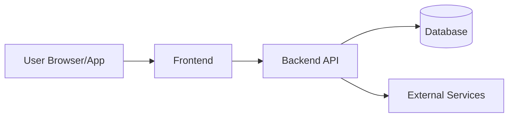
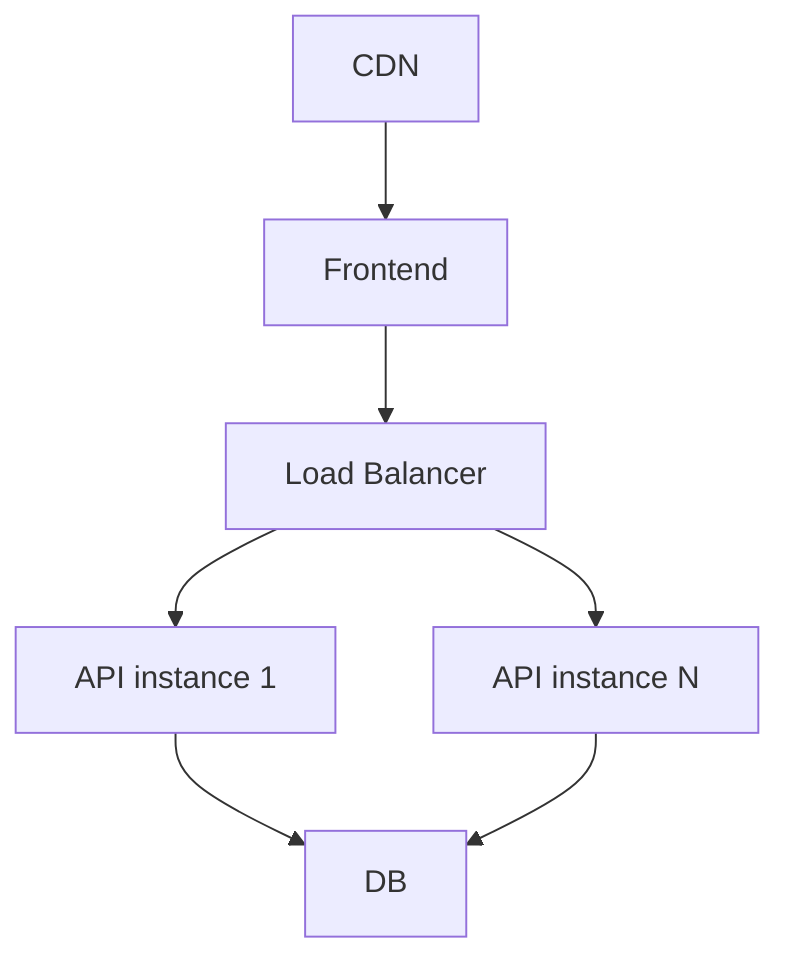
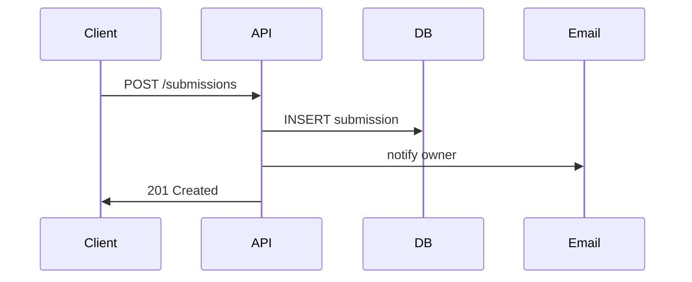

# SAD — System Architecture Document — [System Name]

**Owner:** [SA name] · **Status:** Draft / In review / Approved · **Version:** [x.y]
**Related:** SRS (upstream) · DDD, API Spec, Sec Arch, Deploy Arch (downstream)

---

## 1. Introduction

### 1.1 Purpose
Describes the architecture — component structure, technology choices, and
key design decisions.

### 1.2 Scope
What this document covers vs. what lives in DDD / API Spec.

### 1.3 Definitions
| Term | Meaning |
|---|---|

## 2. Architecture Drivers

### 2.1 Quality Attribute Priorities (from SRS §5 / HND §6.5)
| Rank | Attribute | Target | Rationale |
|---|---|---|---|

### 2.2 Constraints
Technical, business, regulatory — must-follow, not negotiable.

### 2.3 Architecturally Significant Requirements (ASRs)
Requirements that force architectural decisions (typically NFR + key FR).

## 3. Architecture Overview

### 3.1 Chosen Style / Pattern
- **Pattern:** Layered / Hexagonal / Modular monolith / etc.
- **Rationale:** why this over alternatives (top 3 quality attributes it supports)
- **Trade-offs accepted:** what gets worse

### 3.2 Container Diagram (C4 Level 2)

Describe each container + its responsibility.

### 3.3 Component Diagram (C4 Level 3, per container)

Break each container into components. Diagram + description.

## 4. Technology Stack Decisions

Each decision as an ADR (Architecture Decision Record):

### ADR-001: [Decision title]
- **Status:** Proposed / Accepted / Superseded
- **Context:** what forced this decision
- **Options considered:** with pros/cons
- **Decision:** what was chosen
- **Consequences:** positive + negative

(Repeat per major decision: frontend, backend, DB, hosting, auth, etc.)

## 5. Cross-Cutting Concerns

### 5.1 Authentication & Authorization
High-level flow (details in Sec Arch).

### 5.2 Data Persistence
Approach (SQL / NoSQL / hybrid); ORM / query builder / raw.

### 5.3 Caching
Where, TTL, invalidation strategy.

### 5.4 Error Handling & Retry
Client-side + server-side conventions.

### 5.5 Logging & Monitoring
What gets logged, log levels, monitoring stack.

### 5.6 Configuration Management
Env vars, secrets management, feature flags.

## 6. Deployment View

High-level topology (details in Deploy Arch).

## 7. Data View

Reference to DDD for details. High-level entity relationships here.

## 8. Runtime View — Critical Flows

Sequence diagram(s) for 3–5 most critical flows.

## 9. Quality Attribute Analysis

For each top-5 quality attribute:

| Attribute | Tactic used | Trade-off | Verification |
|---|---|---|---|
| | | | |

## 10. Risks

| # | Risk | Impact | Prob | Mitigation |
|---|---|---|---|---|

## 11. Open Questions

| # | Question | Owner | Needed by |
|---|---|---|---|

## 12. Decision Log

| Date | Decision | Rationale | Made by |
|---|---|---|---|
