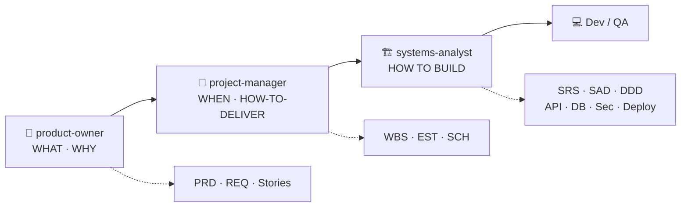

<div align="center">

# 📐 Product Delivery Skills for Claude Code

**ชุดสกิลสำหรับเปลี่ยนไอเดียผลิตภัณฑ์ → เอกสารพร้อมส่งมอบ อย่างเป็นระบบ**
Product Owner · Project Manager · Systems Analyst — ครบทั้งสาย WHAT → WHEN → HOW

[](./LICENSE)
[](./.claude/skills)
[](./documents)
[](https://claude.com/claude-code)

</div>

---

## ✨ ภาพรวม

Repo นี้รวม **3 Claude Code skills** ที่ทำงานต่อกันเป็นสายพาน ตั้งแต่นิยามว่า
*จะสร้างอะไร* ไปจนถึง *ออกแบบระบบยังไง* — พร้อม **ชุดเอกสารตัวอย่างจริง**
(Daily Fitness Companion) ที่เดินครบทั้ง chain แล้ว

แต่ละสกิลมี frontmatter ระบุขอบเขตชัดเจน Claude Code จะโหลดให้อัตโนมัติเมื่อคำขอตรงกับ trigger

---

## 🔄 Workflow



---

## 🧩 Skills

| Skill | ตอบคำถาม | ผลลัพธ์หลัก |
|---|---|---|
| 🧭 **[product-owner](./.claude/skills/product-owner)** | *อะไร / ทำไม* (WHAT / WHY) | PRD, epic, user story, acceptance criteria, backlog ที่จัดลำดับแล้ว |
| 📅 **[project-manager](./.claude/skills/project-manager)** | *เมื่อไหร่ / จะเสร็จอย่างไร* (WHEN) | sprint plan, estimation, forecast, timeline, risk register, status update |
| 🏗️ **[systems-analyst](./.claude/skills/systems-analyst)** | *ระบบออกแบบยังไง* (HOW) | SRS, SAD, DDD, API contract, DB schema, security & deployment architecture |

<details>
<summary><b>รายละเอียดแต่ละสกิล</b></summary>

### 🧭 product-owner
กำหนดว่า **จะสร้างอะไรและทำไม**
- **ทริกเกอร์:** *"write me a spec"*, *"break this feature down"*, *"what should we build first"*, *"is this ready for dev"*
- **ครอบคลุม:** INVEST · Given/When/Then · Definition of Ready · RICE / WSJF / MoSCoW / Kano
- `assets/` เทมเพลต PRD + user story · `references/` การหั่น story + การจัดลำดับความสำคัญ

### 📅 project-manager
วางแผนและส่งมอบงาน — **จะเสร็จเมื่อไหร่และอย่างไร**
- **ทริกเกอร์:** *"will we make the deadline"*, *"we're behind"*, *"how many points can we take"*, *"what's blocking us"*
- **ครอบคลุม:** capacity math · PERT / reference class · critical path · recovery playbook · status / escalation
- `assets/` sprint plan, risk register, status update · `references/` estimation & velocity, risk, stakeholder comms

### 🏗️ systems-analyst
แปลง requirements เป็น **system design**
- **ทริกเกอร์:** *"write SRS"*, *"design the API"*, *"what's the data model"*, *"how do we handle auth"*
- **ครอบคลุม:** IEEE 830-style SRS · ATAM quality attributes · architecture patterns (layered / hexagonal / event-driven / modular monolith) · API contract · DB schema · security (auth / encryption) · PDPA / GDPR / PCI
- `assets/` เทมเพลต SRS, SAD, API spec, DB schema · `references/` quality attributes, architecture patterns, security patterns

</details>

---

## 📦 เอกสารตัวอย่าง — Daily Fitness Companion

ชุดเอกสารจริงที่เดินครบทั้ง chain **PRD → REQ → WBS → EST → SCH → HND → SRS → Stories**
(ผ่าน consistency review + regenerate เป็น PDF/DOCX ที่ **v0.7**) — ดูใน [`documents/`](./documents) และต้นฉบับ markdown ใน [`drafts/`](./drafts)

| # | เอกสาร | โดย | เนื้อหา |
|---|---|---|---|
| 1 | **PRD** | 🧭 PO | Product spec — problem, goals, MoSCoW, business model, rollout |
| 2 | **REQ** | 🧭 PO | Requirements catalog (47 items) + traceability matrix |
| 3 | **Stories** | 🧭 PO | 16 user stories + Given/When/Then AC |
| 4 | **WBS** | 📅 PM | Deliverable hierarchy (100% rule) |
| 5 | **EST** | 📅 PM | Effort estimates + confidence levels |
| 6 | **SCH** | 📅 PM | Milestones + scheduling template |
| 7 | **HND** | 📅 PM | Handover package + system context (PO/PM → SA) |
| 8 | **SRS** | 🏗️ SA | System requirements (IEEE 830-style) |

> เอกสารแต่ละไฟล์ generate เป็น PDF + DOCX ผ่าน [`documents/_generate.sh`](./documents/_generate.sh)
> พร้อม revision tracking ใน [`documents/_revisions.json`](./documents/_revisions.json)

---

## 🚀 การใช้งาน (Claude Code)

สกิลอยู่ใน `.claude/skills/` — Claude Code โหลดให้อัตโนมัติเมื่อคำขอตรงกับ trigger
หรือเรียกตรง ๆ ด้วย slash command:

```
/product-owner   เขียน PRD / story / จัดลำดับ backlog
/project-manager วาง sprint / estimate / timeline / risk
/systems-analyst ออกแบบ SRS / API / data model / architecture
```

**ตัวอย่าง flow:** PO เขียน PRD + Stories → PM วาง WBS/EST/SCH + HND → SA ต่อด้วย SRS → SAD → DDD → Dev/QA

---

## 🗂️ โครงสร้าง Repo

```
.
├── .claude/skills/          # 3 สกิล (โหลดโดย Claude Code)
│   ├── product-owner/       #   SKILL.md · assets/ · references/
│   ├── project-manager/
│   └── systems-analyst/
├── drafts/                  # ต้นฉบับ markdown ของเอกสารตัวอย่าง
├── documents/               # PDF/DOCX ที่ generate แล้ว + generator + revisions
│   ├── _generate.sh         #   md → PDF (Chrome) + DOCX (pandoc)
│   └── _revisions.json      #   revision history
├── source/                  # ไฟล์ .skill bundle ต้นฉบับ
├── LICENSE                  # MIT
└── README.md
```

---

## 🛠️ Regenerate เอกสาร

ต้องมี [`pandoc`](https://pandoc.org) + Google Chrome (สำหรับ PDF)

```bash
cd documents
./_generate.sh --note "รายละเอียดที่แก้"   # auto-bump minor version + regenerate ทุกไฟล์
```

---

## 📄 License

เผยแพร่ภายใต้ [MIT License](./LICENSE) — © 2026 pangsaxo
